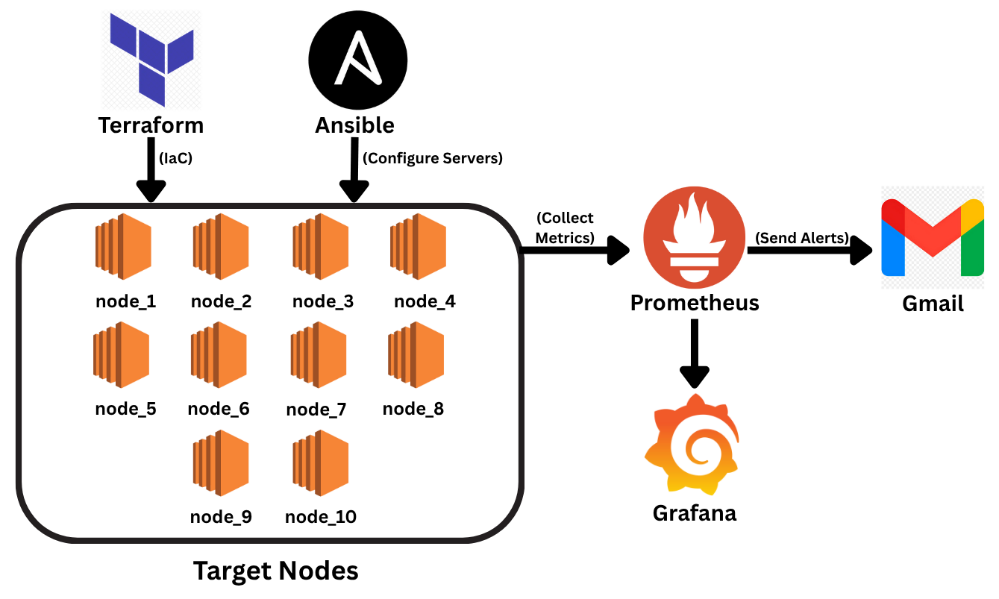

# Automated Cloud Monitoring & Alerting Project

## Overview

This project automates AWS cloud monitoring and alerting using Infrastructure-as-Code principles. It leverages Terraform for cloud provisioning, Ansible for software configuration, Prometheus for metrics collection and alerting, and Grafana for visualization. Docker is also deployed for running demo applications on target nodes.

---

## Architecture

- **Monitor/Control Node**
  - Runs: Prometheus, Alertmanager, Grafana, Terraform, Ansible
  - Orchestrates infrastructure provisioning and configures all target nodes

- **10 Target AWS EC2 Instances**
  - Node Exporter for system metrics
  - Docker (demo app containers)
  - Exposes metrics for monitoring  

- **Alerting**
  - Prometheus triggers alerts when:
    - CPU usage exceeds **85%** for more than **5 minutes**
    - Disk or memory thresholds are crossed
  - Alertmanager sends notification to email/Slack/etc.

---

## Features

- **Automated infrastructure provisioning**: All EC2 instances spun up and security rules applied using Terraform
- **Automated configuration**: Node Exporter, Docker & firewall rules set via Ansible playbooks
- **Centralized monitoring**: All metrics scraped by Prometheus, visualized with Grafana
- **Fast alerting**: Critical conditions trigger alerts, with actionable notifications for operators

---

## Getting Started

### Prerequisites

- AWS account credentials
- Terraform and Ansible installed on Monitor/Control node
- Docker (for Ansible Docker module)
